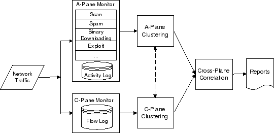
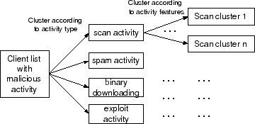

# BotMiner: Clustering Analysis of Network Traffic for Protocol- and Structure-Independent Botnet Detection

<!-- TOC -->

- [背景知识和启发](#背景知识和启发)
- [论文目标与贡献](#论文目标与贡献)
- [BotMiner](#botminer)
    - [C平面监视器](#c平面监视器)
    - [A平面监视器](#a平面监视器)
    - [C平面聚类](#c平面聚类)
    - [A平面聚类](#a平面聚类)
    - [跨平面关联](#跨平面关联)
- [局限和可能的解决方案](#局限和可能的解决方案)
- [参考资料](#参考资料)

<!-- /TOC -->

## 背景知识和启发

* **僵尸网络就像一只军队**
* 僵尸按照相似/相关的方式行动
    * 不是由人操控
    * 与 C&C 程序化地进行通信
    * 即使 C&C 服务器的 IP 和相近网络节点变化，通信模式仍然保持不变
    * 若非如此，僵尸网络会退化为一组不相关/孤立的病毒感染
        * 僵尸**网络**应当和一群**孤立**的单个病毒感染案例有所区别

## 论文目标与贡献

* 基于定义和基本属性进行检测，没有使用先验知识
* 新的“通信流聚合”（C-flow）
* BotMiner

## BotMiner

* 假设
    * 属于同一僵尸网络的僵尸可以提取出相似的恶意行为特征和相似的 C&C 通信特征
* 检测方法
    * 相似的通信流量聚类
        * 谁在和谁说话
        * C平面（C&C 通信流量)
    * 相似的恶意流量聚类
        * 谁在做什么
        * A平面（活动流量）
    * 跨平面关联
        * 找到一个调和的群组模式
* 先验知识
    * 僵尸网络使用的协议
    * 捕获的僵尸程序二进制文件（僵尸网络签名）
    * C&C 服务器名称/地址
    * C&C 通信的内容
* 目标
    * 不依赖与协议与僵尸网络拓扑结构
    * 能抵抗 C&C 位置的改变
    * 不依赖通信内容
    * 低 FP
    * 低 FN
    * 高效率

### C平面监视器

* **谁在和谁说话**
* 限于 TCP 和 UDP
* 每个流记录包含
    * 时间
    * 持续时间
    * 来源IP
    * 源端口
    * 目标IP
    * 目的端口
    * 两个个方向的数据包数量
    * 两个方向的字节数

### A平面监视器

* **谁在做什么**
* 分析出站流量
* 基于 Snort ，并做一定的修改
* 检测几种类型的恶意活动
    * 扫描
        * 统计信息异常检测引擎 （Statistical Scan Anomaly Detection Engine, SCADE）
        * 两类异常检测模块 （一项阳性即可）
            * 异常高的扫描速度
            * 加权连接失败率
    * 垃圾邮件
        * 开发了一个新的 Snort 插件
    * PE（Portable Executable）文件二进制下载
        * PEHunter
        * BotHunter
            * Egg 下载检测
                * Egg：完整的恶意二进制程序
    * 漏洞
    * 容易添加其他僵尸
* 只监视 A平面本身并不足以检测僵尸网络
    * A平面监视的活动并不只存在于 botnets
    * 然而，宽松的设计要求又会产生很多误报

### C平面聚类

* 基本过滤 （F1, F2）
    * 无关的通信流量 （F1）
        * 内部主机
        * 从外部主机到内部主机
    * 没有完全建立的连接 （F2）
* 白名单 （F3）
    * 与众所周知的目的地建立通信
* 对每一个时段 $$E$$, 聚合成通信流 （C-flows）
    * $$c_i = \{f_j\}_{j=1..m}$$, C-flow
        * 其中 $$f_j$$ 具有相同的协议 （TCP/UDP），源 IP 地址，目的 IP 地址，和端口
        * $$m$$, TCP/UDP 数据流的数量
* 特征提取
    * 对于每个 C-flow
        * 时间上
            * 每小时的流量数 （$$fph$$）
            * 美秒字节数 （$$bps$$）
        * 空间上
            * 每个信息流的数据包数 （$$ppf$$）
            * 每个数组包的字节数 （$$bpp$$）
    * 每个特征设立 13 个 bin
    * 特征的总体维度 $$d = 4 \times 13 = 52$$
* 两步聚类
    * 聚类 C-flow 是一个具有挑战性的任务
        * 网络庞大
        * 特征空间维度高
        * 僵尸机器人的比例小
    * X-means， k-means 的变体
        * 不要求使用者选择群集的数量
    * 减少特征
        * $$d = 52$$ 减到 $$d' = 8$$ 
        * $$\{Avg, SD\} \times \{fph, ppf, bpp, bps\}$$
    * 第一步，在整个数据集上进行粗粒度聚类， $$d' = 8$$
    * 第二部，在，每个小数据集上进行完整的聚类， $$d = 52$$
* FP 和 FN 可以通过 A平面降低

### A平面聚类

* 两层
    * 根据活动类型进行聚类
        * 扫描活动特征
            * 扫描端口
            * 目标子网
        * 垃圾邮件活动特征
            * SMTP 链接目的地高度重叠
        * 二进制文件下载
            * 捕获和比较二进制文件的第一部分（数据包）
    * 根据特征进行聚类

### 跨平面关联

* 为每一个宿主 $$h$$，计算僵尸网络评分， $$s(h)$$
* 宿主之间的相似度  $$h_i$$ and $$h_j$$
    * 指示函数（布尔值）
* 分层聚类

## 局限和可能的解决方案

* 逃避 C平面监测和聚类
    * 利用合法的网站
        * 也许无法隐藏辅助网址和相应的通信
    * 操纵通信模式
        * 仍然可以依照 P2P 模式聚类
    * 个体通信模式随机化
        * 测量通信特征的分布和熵
        * 普通用户通信模式不可能过于随机
    * 模拟正常主机的通信模式
    * 隐蔽的信道
    * 个体通信模式随机化、模拟正常主机的通信模式和隐蔽的信道对所有基于流量的检测方法都有限制
* 逃避 A平面监测和聚类
    * 隐秘的恶意活动
        * 扫描速度减慢
        * 减少垃圾邮件数量
    * Botmaster 命令每个宿主随机或独自的执行不同的任务
        * 表现的不像僵尸网络
    * 区别对待宿主，同一受监控网络下的宿主执行不同的命令
        * 分布式监控，更大的监视空间
    * 使用类似 BotHunter 的系统作为补充
* 逃避跨平面分析
    * 任务延迟严重
        * 使用多天的数据并交叉对比几天数据
        * 阻碍攻击效率
        * 宿主可能会下线或关机

## 参考资料

* [BotMiner: Clustering Analysis of Network Traffic for Protocol- and Structure- Independent Botnet Detection](https://www.usenix.org/legacy/event/sec08/tech/full_papers/gu/gu_html/)
* CS 259D Lecture 2
* [botMiner-Security08-slides](http://faculty.cs.tamu.edu/guofei/paper/botMiner-Security08-slides.pdf)
