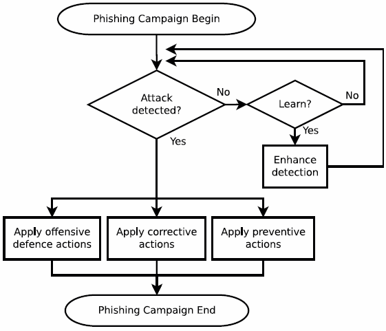

# 网络钓鱼检测

<!-- TOC -->

- [网络钓鱼](#网络钓鱼)
- [网络钓鱼对抗概述](#网络钓鱼对抗概述)
    - [网络钓鱼对抗活动周期](#网络钓鱼对抗活动周期)
    - [挑战](#挑战)
- [检测](#检测)
    - [检测特征](#检测特征)
        - [DNS](#dns)
        - [URL](#url)
        - [HTML](#html)
        - [文本语义](#文本语义)
        - [视觉呈现](#视觉呈现)
        - [模拟用户交互](#模拟用户交互)
    - [检测方法](#检测方法)
        - [用户教育](#用户教育)
        - [黑名单](#黑名单)
        - [启发式](#启发式)
        - [视觉相似性](#视觉相似性)
        - [机器学习](#机器学习)
- [缓解措施](#缓解措施)
    - [进攻式防御](#进攻式防御)
    - [纠正](#纠正)
    - [预防](#预防)
- [评估指标](#评估指标)
- [参考资料](#参考资料)

<!-- /TOC -->

## 网络钓鱼

网络钓鱼是电脑攻击的一种，通过电子通信渠道，向受害人发送以社会工程学的方法编写的信息，以此说服受害人执行特定的动作，并从中获利。

* 第一次网络钓鱼攻击：1995，AOL
* 网络钓鱼的动机
    * 经济利益
    * 隐藏身份
    * 由此获得美名、恶名

## 网络钓鱼对抗概述

### 网络钓鱼对抗活动周期

### 挑战

* 拒绝有关网络钓鱼的教育培训
* 忽略被动警告
* 语义攻击
    * 无法准确的理解自然语言
    * PhishNet-NLP（R Verma, 2012），TP：97%, TN：99.2%

## 检测

### 检测特征

#### DNS

* DNS 投毒
    * Round-Trip Time（RTT）
    * 跳数
* 聚合入侵检测信息
    * Fast-flux
    * DNS TTL

#### URL

* 基于 IP 的 URL
* 子域名个数（超过五个）
* 域名、网址语义
    * 改动过的相似域名
    * [Unicode 域名](https://www.xudongz.com/blog/2017/idn-phishing/)
        * 例子：`apple.com`，`аррӏе.com`

#### HTML

* 对应不上的链接，链接文本与链接本身不符
* 使用 `iframe` 标签在合法网站上呈现钓鱼登陆框
* 从受害站点链接对象（例如, 图像）

#### 文本语义

* 关键词
    * 高 TF-IDF 词语
    * 通过 Google 检索关键词
* 钓鱼邮件、网站中的常见词
    * 单个词语
        * 例如：帐户、更新、确认、验证、保护、日志、单击等。
    * 成组成群出现的词语
        * 例如：点击-帐户、市场-计划-价格
* 常见主题
    * 账户被盗
    * 账户被修改
    * 验证账户
    * （金融）机会
    * 点击链接获取收益
    * 模棱两可的称谓
        * “亲爱的重要客户：”
* 相似的公司、上标名
    * 略做修改
        * 添加
        * 省略
        * 调整子母位置

#### 视觉呈现

* 看起来相似的网页，却来自不可信的网址
* 钓鱼网站旨在模拟目标网站
* 攻击者使用 `img` 标记而不是HTML
    * 看起来像同一个网站
    * 逃避检测器

#### 模拟用户交互

* 模拟随机用户登录给出的响应
* 上（下）一层的网址给出的响应

### 检测方法

* 不同方面/层次:
    * 人类和软件
    * 客户端（例如，浏览器插件）和（电子邮件）服务器
    * 网络（例如，IP、DNS）和应用程序

#### 用户教育

* 把钓鱼攻击告诉用户，而不仅仅是潜在的危害
* 利用这些知识
    * 检测钓鱼攻击
    * 规范行为
* 游戏化
    * [Anti-Phishing Phil](http://www.ucl.ac.uk/cert/antiphishing/)(S Sheng, 2007)
    * 相比较于阅读，人们更爱游戏
* 即使受过教育，也可能无法区分钓鱼网站和合法网站
* 钓鱼警告应该
    * 主动警告，而不是被动警告
    * 及时
    * 不依赖外部资源
    * 解释“原因”以及“应该怎么办”
    * 容易阅读

#### 黑名单

* 假阳性率低
* 系统资源要求低
* 无法应对 zero-hour 钓鱼攻击

#### 启发式

* 假阳性率高于黑名单
* 难以手动维护启发式检测器

#### 视觉相似性

* 假阳性率高于黑名单
* 渲染网页
    * 解析 HTML、CSS 等
    * 运行 JavaScript、Flash 等
* 需要更多的计算和存储资源

#### 机器学习

* 利用大数据构建新模型
* 面对 zero-hour 钓鱼攻击表现的更好

## 缓解措施

* **钓鱼攻击缓解措施基于准确的钓鱼检测**

### 进攻式防御

* 洪水攻击钓鱼网站
* 难以衡量成效

### 纠正

* 移除钓鱼资源
    * 删除钓鱼内容
    * 关停服务器、僵尸宿主
    * 查封账号

### 预防

* 防止攻击者进行钓鱼攻击
    * 诉诸法律
    * 处罚

## 评估指标

* 常见的统计学误差

## 参考资料

* Phishing Detection: A Literature Survey
* [PHISHING DETECTION](https://www.slideshare.net/ummeayesha/phishing-detection)
* A Survey of Phishing Email Filtering Techniques
* [CSCD 303 Essential Computer Security](http://penguin.ewu.edu/cscd303/), [Phishing.pdf](http://penguin.ewu.edu/cscd303/CourseNotes/CSCD303-Lecture11a-Phishing-2017.pdf)
* [cylab-anti-phishing-Aug2007.ppt](https://www.cs.cmu.edu/~jasonh/presentations/cylab-anti-phishing-Aug2007.ppt)
* Detecting Phishing Emails the Natural Language Way
* [Phishing with Unicode Domains](https://www.xudongz.com/blog/2017/idn-phishing/)
