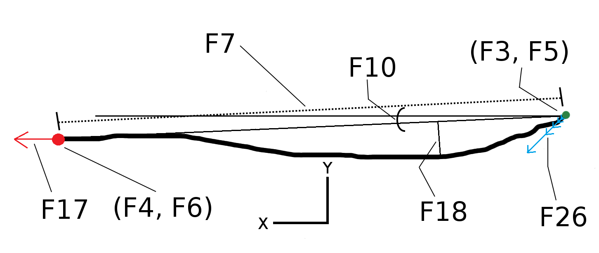

# Touchalytics: On the Applicability of Touchscreen Input as a Behavioral Biometric for Continuous Authentication

<!-- TOC -->

- [移动设备上的入口点身份验证](#移动设备上的入口点身份验证)
- [论文贡献](#论文贡献)
- [数据来源](#数据来源)
- [触摸手势](#触摸手势)
- [特征](#特征)
- [分类](#分类)
- [局限](#局限)
- [参考资料](#参考资料)

<!-- /TOC -->

## 移动设备上的入口点身份验证

* 可用性
    * 不便于快速活动
        * 查看邮件
        * 阅读短信
    * 牺牲安全保障
        * 使用短密码
        * 增加锁屏延时
        * 禁用解锁
* 被盗风险高

## 论文贡献

* 基于触摸生物行为信息验证

## 数据来源

* Android手机
* 任务：阅读文档，比较图像
* 原始特征
    * 事件代码
        * 手指向上
        * 手指向下
        * 手指移动
        * 多点触摸
    * 活动时间
    * 设备方向
    * 手指的x，y坐标
    * 手指压力
    * 屏幕上，手指覆盖的区域
    * 相对于屏幕方向的手指方向
* 记录工具
    * 用于阅读文档和查看不同图像的 APP
        * 输入用户 ID
        * 文档和图像的链接

## 触摸手势

* 触发动作
    * 水平滑过屏幕
        * 浏览图片
        * “下一页”图标
    * 垂直滑过屏幕
        * 阅读电子邮件、文档、网页
        * 浏览菜单栏
* 只记录触发动作
* 复杂的手势并不常见
* 无法通过“单击”获得足够的特征

## 特征

* 笔画
    * 触摸数据序列，开始于手指触摸屏幕，结束于手指离开屏幕
    * 向量序列
        * $$s_n = (x_n, y_n, t_n, p_n, A_n, o_n^f, o_n^{ph}),\ n \in \{1, 2, ..., N\}$$
            * $$x_n$$, $$y_n$$，坐标
            * $$t_n$$，时间戳
            * $$p_n$$，施加在屏幕上的压力
            * $$A_n$$手指覆盖的面积
            * $$o_n^f$$，手指的方向
            * $$o_n^{ph}$$，手机的方向（横向或纵向）
* 30个特征
* 信息熵
* 信息量最大的单一特征
    * Area covered by fingertip
    * 20% percentile of the stroke velocity
    * Fingertip pressure on screen
    * Direction of the stroke
* $$x\text{-position}$$ 坐标的信息量比 $$y\text{-position}$$ 更大

## 分类

* kNN
    * 使用 k-d tree
    * 欧几里德距离
    * k 取值 1-7
        * 交叉验证
* SVM
    * RBF kernel
        * 5-fold 交叉验证
* 结合多个笔画的分数
    * 设置阈值

## 局限

* 用户不会尝试模仿其他用户的触摸行为
    * 人类很难模仿30个特征
    * 恶意应用可以尝试学习用户的行为
* 屏幕尺寸可能会影响触摸行为
    * 智能手机
        * 小屏幕
        * 需要更多的滚动
    * 平板电脑
        * 大屏幕
        * 较少滚动
        * 更多的自由度

## 参考资料

* Touchalytics: On the Applicability of Touchscreen Input as a Behavioral Biometric for Continuous Authentication, 2013
* [Touchalytics](http://www.mariofrank.net/touchalytics/index.html)
* CS 259D Lecture 7
